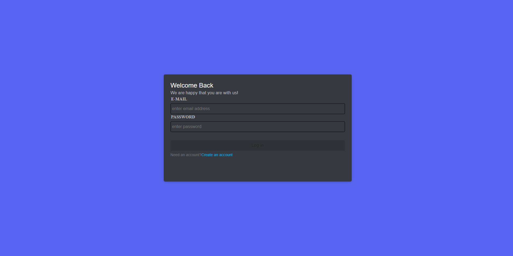
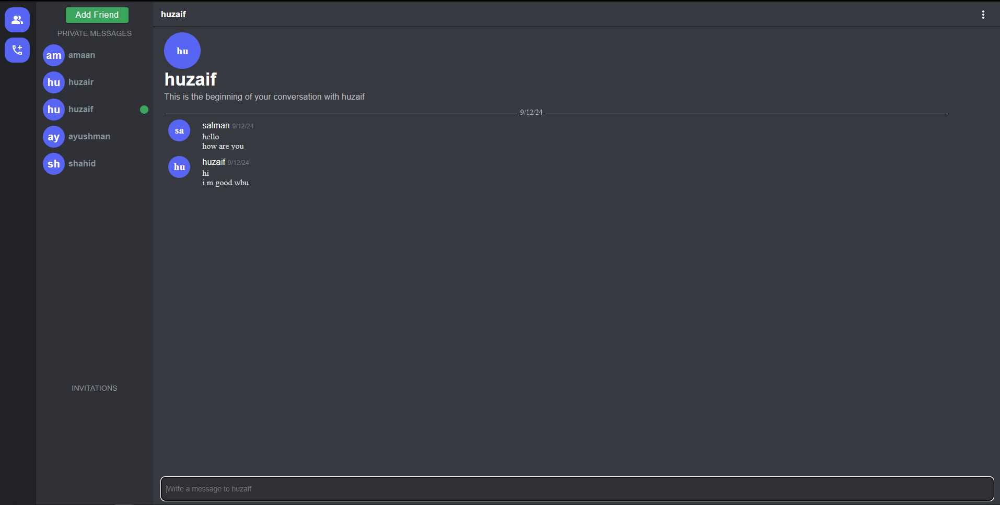
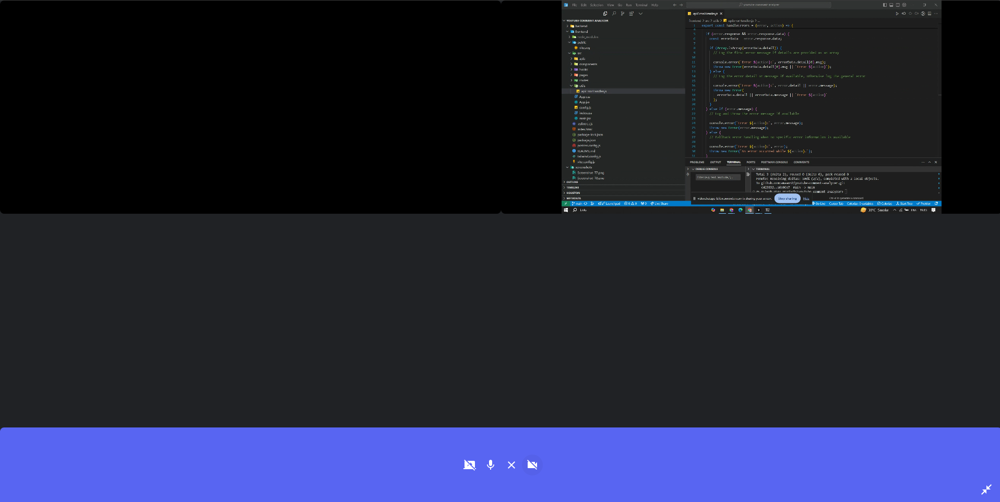
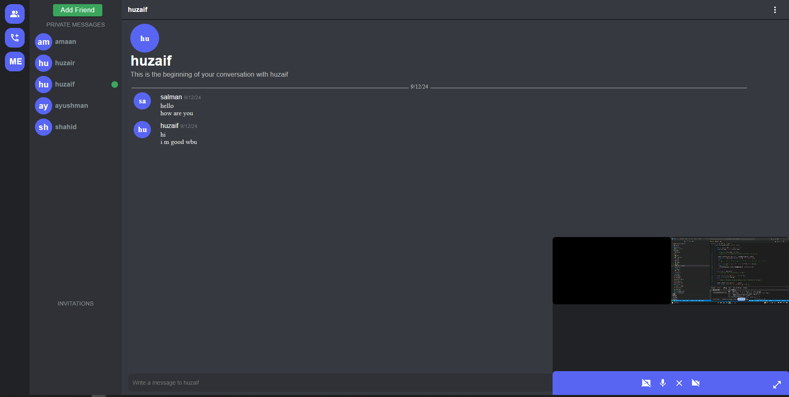

# Realtime Chat Application

This is a fully functional real-time communication web application that allows users to connect, chat, and interact with their friends. The application is designed for a seamless communication experience with features like text chat, video calling, and screen sharing.

You can access the live application at [this link](https://videochatapp-b5bx.onrender.com/dashboard).

## Features

- **Add New Friends:** Users can add new friends by using email id.
- **Private Chat:** Users can chat in real-time with their friends through private messages.
- **Video Calls:** Users can initiate one-on-one video calls with their friends.
- **Group Video Calls:** A group of up to 4 friends can participate in a group video call simultaneously.
- **Screen Sharing:** Share your screen during video calls for better collaboration or presentations.
- **Minimal and User-Friendly UI:** A clean and easy-to-navigate interface to ensure smooth communication.

## Technologies Used

- **Frontend:** React.js
- **Backend:** Node.js with WebSocket support
- **Database:** MongoDB for user and message storage
- **Real-Time Communication:** Socket.io for live updates

## Future Enhancements

This project is a work in progress, and additional features will be added in the future, including:

- Typing indicators in chat
- Message delivery status (sent, delivered, read)
- Group chat functionality with admin controls
- Improved notification system
- Enhanced video call quality and additional settings
- Unsend chat feature
- Unfriend feature
- Better UI

## Screenshots

## Contribute or Share Ideas

If you have any suggestions or feature ideas, feel free to reach out to me at ansari028amaan@gmail.com. Collaboration and feedback are always welcome.
